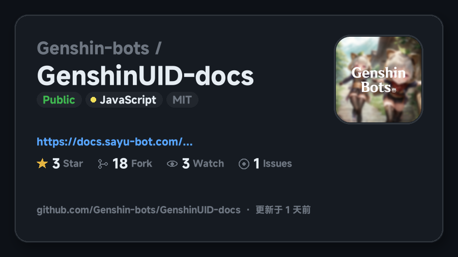
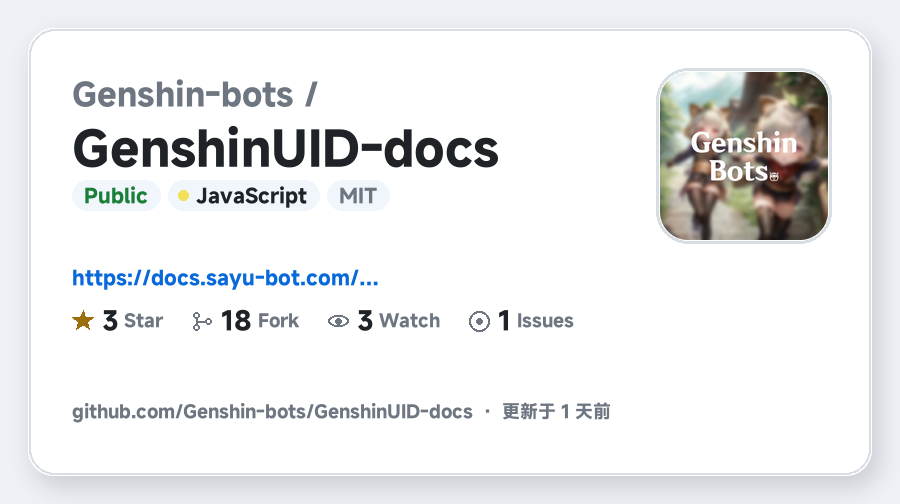

<p align="center">
  <a href="https://github.com/MimoKit/MikuSnap"></a>
</p>

<h1 align="center">MikuSnap v1.3.1</h1>
<h4 align="center">✨ 基于 GsCore 的网页自动截图 + GitHub 仓库卡片插件 ✨</h4>

<div align="center">
  <a href="https://github.com/Genshin-bots/gsuid_core">早柚核心</a> &nbsp;·&nbsp;
  <a href="https://docs.sayu-bot.com/InstallPlugins/PluginsList.html">插件市场</a> &nbsp;·&nbsp;
  <a href="https://qm.qq.com/q/ejzCUfJ5le">交流 Q 群 (798949533)</a> &nbsp;·&nbsp;
  <a href="https://github.com/MimoKit/MikuSnap/issues">问题反馈</a>
</div>

<br/>

## 丨安装提醒

> **注意：该插件为 [早柚核心 (gsuid_core)](https://github.com/Genshin-bots/gsuid_core) 的扩展，必须先部署好 GsCore 才能使用。**
>
> 支持 NoneBot2 / HoshinoBot / ZeroBot / YunzaiBot / Koishi / AstrBot 等已接入 GsCore 的上游 Bot。
>
> 首次安装或更新后请重启 GsCore 以完全应用。

> [!NOTE]
> 插件仍在持续迭代。使用中有问题或建议，欢迎提 [Issue](https://github.com/MimoKit/MikuSnap/issues) 或加入交流群 **798949533**。

<br/>

## 丨安装方式

**方式一（推荐）：** 在已连接 GsCore 的会话中发送：

```text
core安装插件MikuSnap
gs重启
```

然后安装 Chromium（未装过 Playwright 浏览器时必须执行，否则截图会卡住）：

```bash
playwright install chromium
```

**方式二：** 手动克隆到 GsCore 插件目录后重启：

```bash
cd /path/to/gsuid_core/gsuid_core/plugins
git clone https://github.com/MimoKit/MikuSnap.git
```

依赖已写入 `pyproject.toml`，新版 GsCore 会自动检查安装。若你的 Core 不会自动处理依赖，请在同一 Python 环境中手动安装：

```bash
pip install "httpx[socks]>=0.27.0" "playwright>=1.40.0" "Pillow>=10.0.0"
playwright install chromium
```

<br/>

## 丨快速上手

安装完成后，发送下面指令可获取可视化帮助图：

```text
网页截图帮助
```

### 常用功能

| 触发指令 | 功能说明 | 备注 |
| :--- | :--- | :--- |
| 聊天中直接发链接 | 自动截取网页并发送图片 | 可在服务管理中关闭对应 SV |
| `网页截图 <链接>` | 手动指定 URL 截图 | 别名：`网页快照` |
| `https://github.com/owner/repo` | 绘制仓库信息卡片 | 可在控制台改回整页截图 |
| `仓库卡片 owner/repo` | 手动生成仓库 / 用户卡片 | 别名：`github` |
| `网页截图帮助` | 查看帮助图 | 别名：`截图帮助` |

<br/>

## 丨功能

聊天里出现 `http/https` 链接时自动截图；识别到 GitHub 仓库或用户主页时，改为绘制信息卡片（Star / Fork / Watch / Issues、语言、协议、主题、更新时间），并跟随控制台「深色模式」。

<p align="center">
  <b>GitHub 仓库卡片 · 深色</b><br/>
  
</p>

<p align="center">
  <b>GitHub 仓库卡片 · 浅色</b><br/>
  
</p>

其他行为：

- 默认深色模式渲染，支持 `prefers-color-scheme: dark` 的网站自动切暗色
- 截图前预滚动页面触发懒加载，并自动丢弃纯白、纯黑等空白图
- 智能跳过视频站（B 站 / YouTube / 抖音等）、图片与文件直链、内网地址
- 拦截国内外查 IP / 泄漏检测站；自定义查 IP 页打开后扫标题正文，命中则丢掉截图并骂回去
- 可在控制台填写额外屏蔽域名、固定出口代理，或 IP 代理池提取 API（每次截图换一个代理 IP）
- 超长网页按视口高度用 Pillow 本地切成多张发送
- 限制同时运行的截图任务数，避免刷屏

<br/>

## 丨GitHub 代理

国内直连 GitHub API 经常超时。在网页控制台 **MikuSnap → GitHub 解析** 里填一项即可：遇到 GitHub 链接会自动走代理。

| 配置 | 示例 | 说明 |
| :--- | :--- | :--- |
| GitHub 网页代理 | `https://gh-proxy.com` | 把 GitHub 网页 / API / 头像改写成加速地址。镜像站可填 `https://kkgithub.com` |
| GitHub HTTP/SOCKS 代理（VPN） | `http://127.0.0.1:7890` | 走本机 Clash / VPN。SOCKS 示例：`socks5://127.0.0.1:7891` |
| GitHub Token（可选） | `ghp_xxx` | 提高 API 限额，公开仓库不需要额外权限 |

两种代理可以只填一个，也可以同时填。卡片解析失败时，会用同一套代理回退成截 GitHub 网页。

<br/>

## 丨常用配置

截图参数、过滤规则和发送样式使用插件内置默认值。需要用户控制的选项如下：

| 配置 | 默认 | 说明 |
| :--- | :---: | :--- |
| 深色模式 | ✅ | 网页截图与 GitHub 卡片共用；关闭则浅色 |
| 解析 GitHub 为信息卡片 | ✅ | 关闭后 GitHub 链接改走整页截图 |
| 额外屏蔽网站 | 空 | 一行一个域名，自动/手动都不截 |
| 截图出口代理（伪装 IP） | 空 | 固定代理兜底，如 `http://127.0.0.1:7890` |
| IP 代理池提取 API | 空 | 每次截图拉取 `ip:port`，用代理池 IP 访问 |
| 代理池协议 | http | 稻米 httptype=1 用 http |
| GitHub 网页代理 | 空 | 如 `https://gh-proxy.com` |
| GitHub HTTP/SOCKS 代理 | 空 | 如 `http://127.0.0.1:7890` |
| GitHub Token | 空 | 可选，提高 API 限额 |
| GitHub 请求超时 | 15 秒 | 拉取仓库 API / 头像 |
| GitHub 结果缓存 | 600 秒 | 同一仓库在缓存期内不重复请求 |

<br/>

## 丨其他

+ 如果对本插件有功能建议 & Bug 报告，欢迎提 Issue & PR，每一条都会详细看过
+ 如果本插件对你有帮助，不要忘了点个 Star~
+ 提交信息请遵循仓库内 [`COMMIT_TEMPLATE.md`](./COMMIT_TEMPLATE.md)（与 [gsuid_core](https://github.com/Genshin-bots/gsuid_core) 相同的 gitmoji 风格）
+ 本项目仅供学习使用，请勿用于商业用途
+ [GPL-3.0 License](./LICENSE)
